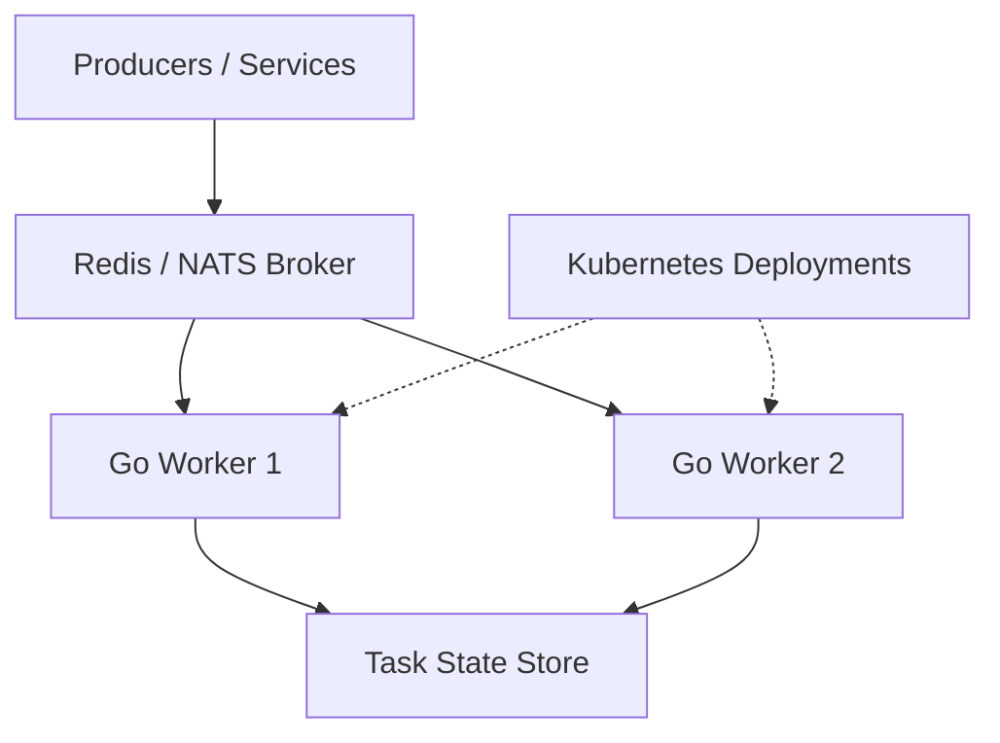

# Calebsons Go Cloud-Native — Distributed Task Queue

## Overview
A distributed task queue system with worker pools, gRPC communication, and Kubernetes-ready deployments.

## Tech Stack
- Go
- gRPC
- Redis / NATS
- Kubernetes

## Features
- Distributed workers
- Task scheduling
- Retry logic
- gRPC API
- Horizontal scaling

## Architecture

## Setup
    go mod tidy
    go run cmd/server/main.go

## Deployment
- Kubernetes
- Helm (optional)

## Roadmap
- Add dashboard UI
- Add delayed jobs
