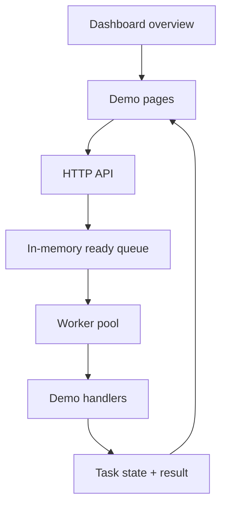

# Calebsons Go Cloud-Native — Distributed Task Queue

## Overview
A distributed task queue with an in-process worker pool, HTTP API, retries,
and a multi-page ops dashboard (shared side rail on overview and every demo).
Five real-world demos each get their own page so you can enqueue and watch
work for that workflow in isolation.

## Tech stack
- Go 1.22+
- In-memory broker + worker pool (no external deps for local demos)
- Embedded HTML/CSS/JS dashboard

## Demo use cases
| Kind | Page | What it simulates |
|------|------|-------------------|
| `email` | `/demos/email` | Welcome emails & notifications |
| `media` | `/demos/media` | Image / video processing |
| `reports` | `/demos/reports` | Invoice & report generation |
| `webhooks` | `/demos/webhooks` | Third-party sync with flaky retries |
| `cleanup` | `/demos/cleanup` | Data cleanup & maintenance |

## Features
- Typed tasks by demo `kind`
- Enqueue / list / get / cancel
- Configurable worker concurrency
- Retry with exponential backoff and dead-letter status
- Shared dashboard shell: overview + per-demo pages
- Demo seed tasks on startup (`SEED_DEMO=true`)

## Architecture

```mermaid
flowchart TD
    HOME[Dashboard overview] --> DEMO[Demo pages]
    DEMO --> API[HTTP API]
    API --> QUEUE[In-memory ready queue]
    QUEUE --> W[Worker pool]
    W --> HANDLER[Demo handlers]
    HANDLER --> STATE[Task state + result]
    STATE --> DEMO
```

## Quick start
```bash
go run ./cmd/server
```

Open http://localhost:8080

| Env | Default | Meaning |
|-----|---------|---------|
| `PORT` | `8080` | HTTP listen port |
| `WORKERS` | `3` | Concurrent worker goroutines |
| `SEED_DEMO` | `true` | Enqueue one sample job per demo |

## API
- `GET /health`
- `GET /api/demos` — catalog of demo pages
- `GET /api/demos/{kind}`
- `GET /api/stats?kind=`
- `GET /api/tasks?kind=&status=&page=&limit=`
- `POST /api/tasks` — body `{ "kind", "name", "payload", "max_attempts" }`
- `GET /api/tasks/{id}`
- `POST /api/tasks/{id}/cancel`

## Docs
See [WALKTHROUGH.md](./WALKTHROUGH.md) for setup, UI checks, and curl examples.

## Roadmap
- Redis / NATS broker
- Delayed jobs (`run_at`)
- gRPC service surface
- Kubernetes / Helm deploys
